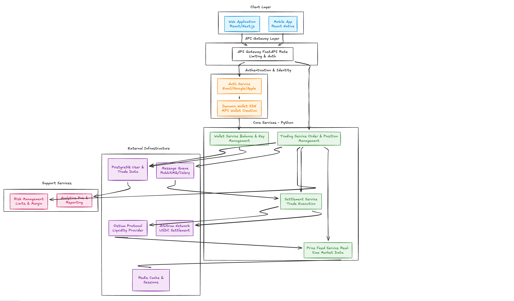
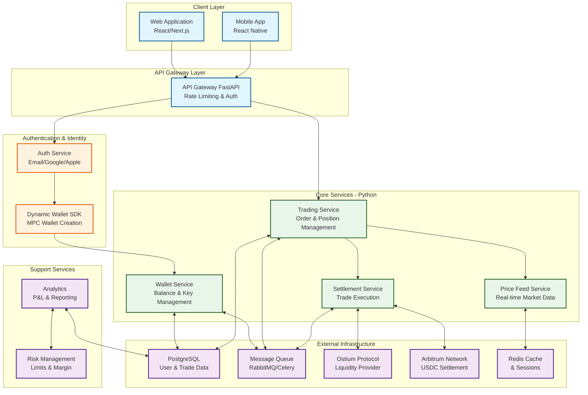

# MarqetFi API

A high-performance trading platform API built with FastAPI, providing secure wallet management, order execution, and real-time market data services.

## Quick Start

```bash
# 1. Clone and setup
git clone <repository-url>
cd marqetfi-api
make setup

# 2. Configure environment
cp .env.example .env
# Edit .env with your settings

# 3. Start services (PostgreSQL, Redis, RabbitMQ)
make docker-up

# 4. Run migrations
make migrate

# 5. Start application (FastAPI + Celery worker + Celery beat)
make run
```

API available at `http://localhost:8000` | Docs: `http://localhost:8000/docs`

## Architecture



<details>
<summary>View Mermaid Diagram</summary>



</details>

**Mermaid Source**: [assets/hld_mermaid.mmd](./assets/hld_mermaid.mmd)

## Features

- 🔐 **Secure Authentication**: Email, Google, and Apple OAuth support
- 💼 **MPC Wallet Management**: Secure multi-party computation wallet creation and management
- 📊 **Trading Services**: Order management, position tracking, and trade execution
- 💱 **Real-time Market Data**: Live price feeds with Redis caching
- ⚡ **Asynchronous Processing**: RabbitMQ/Celery for background tasks
- 🛡️ **Risk Management**: Limits, margin controls, and position monitoring
- 📈 **Analytics**: P&L calculations and comprehensive reporting
- 🔗 **Blockchain Integration**: Arbitrum Network for USDC settlement
- 💧 **Liquidity**: Ostium Protocol integration for trading liquidity

## Development

### Prerequisites

- Python 3.11+
- PostgreSQL 14+, Redis 6+, RabbitMQ 3.9+
- Docker & Docker Compose (for infrastructure)

### Common Commands

```bash
make setup          # Install dependencies and setup pre-commit hooks
make run            # Start FastAPI + Celery worker + Celery beat
make test           # Run tests with coverage
make lint           # Run all linters
make format         # Format code with black and isort
make pre-commit     # Run pre-commit hooks on all files
make docker-up      # Start infrastructure services
make docker-down    # Stop infrastructure services
make migrate        # Run database migrations
make clean          # Clean cache and build files
```

### Running Services Individually

```bash
python run.py --server-only    # FastAPI only
python run.py --worker-only    # Celery worker only
python run.py --beat-only      # Celery beat only
python run.py --no-beat        # Server + worker (no beat)
```

### Pre-commit Hooks

Pre-commit hooks automatically run on every commit. Setup is included in `make setup`.

Hooks run:
- Code formatting (Black, Ruff)
- Import sorting (isort)
- Linting (Ruff)
- Type checking (mypy)
- File checks (trailing whitespace, large files, etc.)

## API Documentation

- **Swagger UI**: `http://localhost:8000/docs`
- **ReDoc**: `http://localhost:8000/redoc`

## Deployment

### Docker

```bash
docker build -t marqetfi-api .
docker run -p 8000:8000 --env-file .env marqetfi-api
```

### Production Checklist

- Set `DEBUG=false`
- Use strong `SECRET_KEY`
- Configure CORS origins
- Enable database connection pooling
- Enable Redis persistence
- Configure RabbitMQ clustering
- Set up monitoring and logging
- Use HTTPS/TLS
- Implement rate limiting
- Set up backup strategies

## Contributing

1. Fork the repository
2. Create a feature branch
3. Make your changes
4. Run `make test` and `make lint`
5. Commit (pre-commit hooks will run automatically)
6. Push and open a Pull Request
