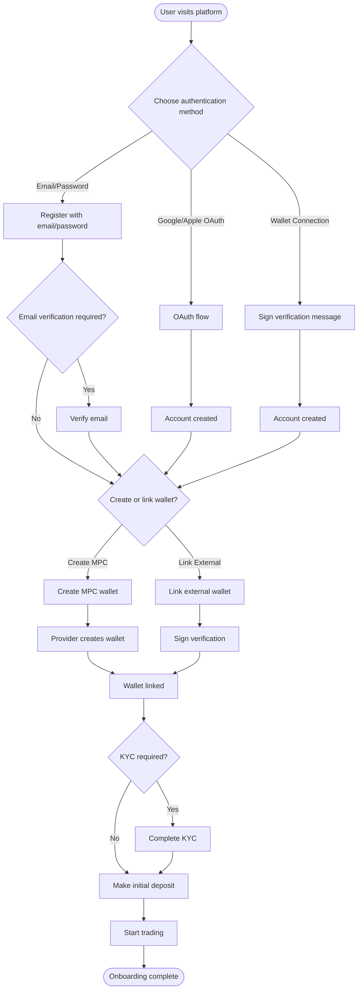
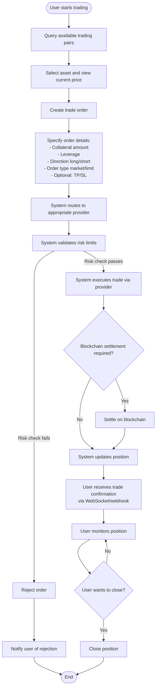
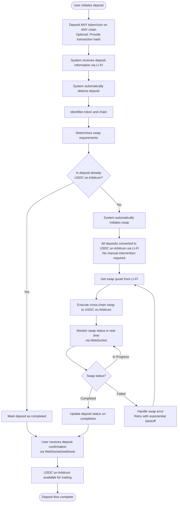
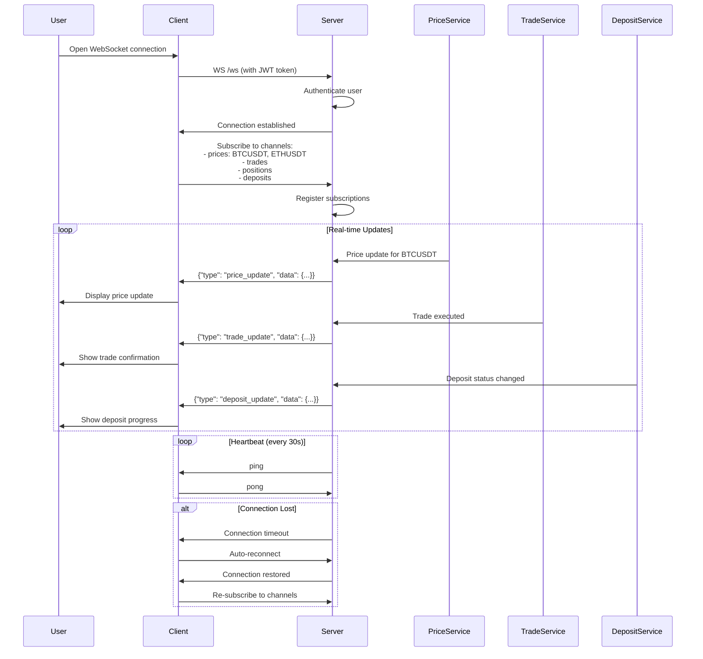
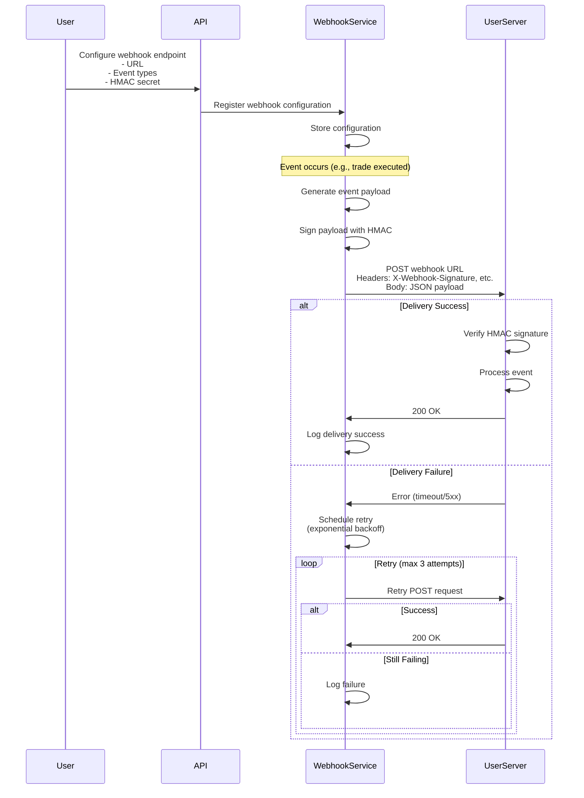
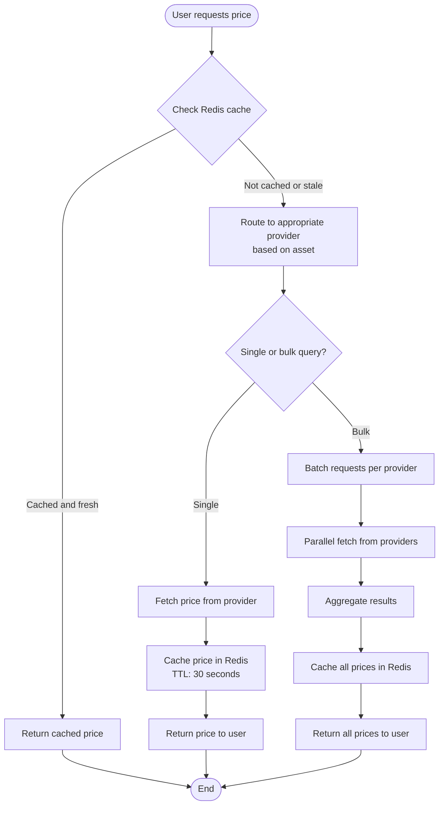

# Product Requirements Document (PRD)
## MarqetFi API

**Version:** 1.0.0
**Last Updated:** 2025-12-24
**Status:** Active

---

## 1. Executive Summary

### 1.1 Product Vision
MarqetFi API is a high-performance, multi-provider trading platform API that enables users to trade financial instruments (crypto, forex, indices, commodities) through a unified interface. The platform bridges Web2 and Web3 authentication, supports multiple liquidity providers, and provides automated deposit management with cross-chain token swapping.

### 1.2 Product Goals
- **Mobile-First Platform**: WebSocket support for real-time updates optimized for mobile applications
- **Unified Trading Experience**: Single API for trading across multiple asset classes and liquidity providers
- **Flexible Authentication**: Support both traditional (email/OAuth) and Web3 (wallet) authentication methods
- **Automated Operations**: Automatic token swapping via LI-FI (any token/chain → USDC on Arbitrum), multi-provider routing, and background task processing
- **Advanced Trading**: Support for advanced order types (stop-loss, take-profit, trailing stops)
- **Real-Time Notifications**: WebSocket streaming and webhook system for instant updates
- **Enterprise-Ready**: Database-backed configuration, comprehensive admin controls, and robust error handling
- **High Performance**: Async architecture, caching, and optimized for low-latency trading operations

### 1.3 Success Metrics
- **API Uptime**: 99.9% availability
- **Response Time**: <200ms for price queries, <500ms for trade execution
- **Throughput**: Support 1000+ concurrent users
- **Trade Execution**: <1% failure rate
- **User Satisfaction**: <5% error rate on critical operations

---

## 2. User Personas

### 2.1 Retail Trader (Primary)
- **Demographics**: Individual traders, crypto enthusiasts
- **Goals**: Easy access to multiple markets, quick trade execution, secure wallet management
- **Pain Points**: Complex onboarding, multiple platforms, security concerns
- **Key Features**: MPC wallets, simple authentication, real-time prices, quick deposits

### 2.2 Institutional Trader (Secondary)
- **Demographics**: Trading firms, hedge funds, market makers
- **Goals**: High throughput, API access, advanced risk management, reliable execution
- **Pain Points**: API reliability, rate limits, integration complexity
- **Key Features**: Admin API, configuration management, analytics, webhooks

### 2.3 Mobile App User (Tertiary)
- **Demographics**: Mobile-first traders, on-the-go users
- **Goals**: Trade from anywhere, push notifications, simple UI
- **Pain Points**: Limited mobile trading options, poor UX
- **Key Features**: RESTful API, WebSocket support (future), mobile-optimized responses

---

## 3. Core Features

### 3.1 Authentication & Identity Management

#### 3.1.1 Web2 Authentication
- **Email/Password**: Traditional email-based registration and login
- **OAuth Integration**:
  - Google OAuth
  - Apple OAuth
  - Auth0 management
- **Session Management**: JWT-based sessions with refresh tokens
- **Email Verification**: Optional email verification flow

#### 3.1.2 Web3 Authentication
- **Wallet Connection**: Connect external wallets (MetaMask, WalletConnect, etc.)
- **Signature Verification**: Verify wallet signatures for authentication
- **MPC Wallet Support**:
  - Privy.io integration
  - Dynamic.xyz integration
  - Embedded wallet creation and management

#### 3.1.3 Multi-Auth Support
- Users can link multiple authentication methods
- Seamless switching between auth methods
- Unified user profile across auth methods

### 3.2 Wallet Management

#### 3.2.1 MPC Wallet Operations
- **Wallet Creation**: On-demand MPC wallet creation via provider APIs
- **Balance Management**: Query balances across chains
- **Key Management**: Secure key storage (never exposed to API)
- **Wallet Recovery**: Provider-managed recovery mechanisms

#### 3.2.2 External Wallet Support
- **Wallet Linking**: Connect external wallets to user account
- **Multi-Wallet**: Support multiple wallets per user
- **Wallet Verification**: Signature-based verification

### 3.3 Trading Services

#### 3.3.1 Order Management
- **Market Orders**: Immediate execution at current market price
- **Limit Orders**: Execute at specified price or better
- **Advanced Order Types**:
  - **Stop-Loss Orders**: Automatically close position when price reaches stop-loss level
  - **Take-Profit Orders**: Automatically close position when price reaches take-profit level
  - **Trailing Stop Orders**: Stop-loss that follows favorable price movement
  - **OCO Orders**: One-Cancels-Other orders (stop-loss and take-profit together)
- **Order Types**: Support for various order types per provider
- **Order Status**: Real-time order status tracking

#### 3.3.2 Position Management
- **Open Positions**: Track active positions across providers
- **Position Details**: Leverage, collateral, P&L, entry price
- **Position Closing**: Close positions with market or limit orders
- **Multi-Provider Positions**: Aggregate positions from all providers

#### 3.3.3 Trade Execution
- **Provider Routing**: Automatic routing to appropriate provider based on asset
- **Settlement**: On-chain settlement via Arbitrum for USDC
- **Trade History**: Complete audit trail of all trades
- **Trade Analytics**: P&L calculations, win rate, trade statistics

### 3.4 Price Feeds

#### 3.4.1 Real-Time Prices
- **Single Price Query**: Get current price for a trading pair
- **Bulk Price Query**: Get prices for multiple pairs in one request
- **Price Caching**: Redis-based caching for frequently accessed prices
- **Provider-Agnostic**: Unified price interface across providers

#### 3.4.2 Trading Pairs
- **Pair Discovery**: List available trading pairs
- **Category Filtering**: Filter by asset category (crypto, forex, indices, commodities)
- **Provider-Specific Pairs**: View pairs per provider

### 3.5 Deposit & Swap Management

#### 3.5.1 Deposit Processing
- **Multi-Chain Deposits**: Accept deposits on any supported blockchain
- **Multi-Token Support**: Accept any token/coin on any chain via LI-FI
- **Universal Deposit**: Users can deposit any cryptocurrency from any chain
- **Deposit Tracking**: Real-time deposit status and history
- **Transaction Verification**: Blockchain transaction verification

#### 3.5.2 Automatic Token Swapping via LI-FI
- **Universal Conversion**: All deposits automatically converted to USDC on Arbitrum
- **LI-FI Integration**: Primary swap provider for all cross-chain conversions
- **Auto-Detection**: System automatically detects deposit and initiates swap
- **Swap Execution**: Execute cross-chain swaps via LI-FI to convert to USDC on Arbitrum
- **Swap Tracking**: Monitor swap status and completion in real-time
- **Error Handling**: Retry logic and error recovery for failed swaps
- **Convenience**: Users don't need to manually swap - system handles everything

### 3.6 Multi-Provider Routing

#### 3.6.1 Intelligent Routing
- **Asset-Based Routing**: Route based on asset symbol (BTC → Lighter, EURUSD → Ostium)
- **Category-Based Routing**: Route based on asset category
- **Configurable Routing**: Admin-configurable routing rules
- **Fallback Handling**: Graceful fallback when provider unavailable

#### 3.6.2 Provider Management
- **Provider Factory**: Dynamic provider instantiation
- **Provider Configuration**: Per-provider settings and credentials
- **Provider Health**: Monitor provider availability and performance
- **Provider Switching**: Seamless switching between providers

### 3.7 Admin & Configuration

#### 3.7.1 Configuration Management
- **Database-Backed Config**: Runtime configuration without restarts
- **App Configuration**: Application-level settings (security, CORS, logging)
- **Provider Configuration**: Per-provider settings with versioning
- **Encryption**: Automatic encryption of sensitive values

#### 3.7.2 Admin API
- **Configuration CRUD**: Create, read, update, delete configurations
- **Provider Management**: Enable/disable providers, update settings
- **User Management**: View users, manage permissions
- **Analytics Access**: View platform analytics and metrics

### 3.8 Risk Management

#### 3.8.1 Position Limits
- **Leverage Limits**: Maximum leverage per user/asset
- **Position Size Limits**: Maximum position size
- **Margin Requirements**: Minimum margin requirements
- **Risk Checks**: Pre-trade risk validation

#### 3.8.2 Monitoring
- **Real-Time Monitoring**: Monitor positions and P&L
- **Alert System**: Alerts for risk threshold breaches
- **Analytics**: Risk metrics and reporting

### 3.9 WebSocket Real-Time Updates

#### 3.9.1 Real-Time Price Streaming
- **Price Updates**: Real-time price updates for subscribed trading pairs
- **Mobile-Optimized**: Designed for mobile-first platform with efficient bandwidth usage
- **Subscription Management**: Subscribe/unsubscribe to multiple pairs
- **Connection Management**: Automatic reconnection and heartbeat

#### 3.9.2 Real-Time Trade Updates
- **Order Status**: Real-time order execution and status updates
- **Position Updates**: Live position P&L and status changes
- **Trade Confirmations**: Instant trade confirmation notifications

#### 3.9.3 Real-Time Deposit Updates
- **Deposit Status**: Real-time deposit and swap status updates
- **Swap Progress**: Live swap execution progress
- **Completion Notifications**: Instant notifications when deposits/swaps complete

### 3.10 Webhook System

#### 3.10.1 Event Notifications
- **Trade Events**: Notifications for trade execution, position changes, order fills
- **Deposit Events**: Notifications for deposit received, swap started, swap completed
- **Account Events**: Notifications for account changes, wallet connections
- **Risk Events**: Notifications for margin calls, position liquidations

#### 3.10.2 Webhook Configuration
- **Endpoint Management**: Configure webhook URLs per user/application
- **Event Selection**: Subscribe to specific event types
- **Retry Logic**: Automatic retry for failed webhook deliveries
- **Security**: HMAC signature verification for webhook authenticity
- **Payload Format**: JSON payloads with event metadata

---

## 4. User Flows

### 4.1 User Registration & Onboarding

### 4.2 Trading Flow

### 4.3 Deposit & Swap Flow

### 4.4 WebSocket Connection Flow

### 4.5 Webhook Event Flow

### 4.6 Price Query Flow

---

## 5. Functional Requirements

### 5.1 Authentication Requirements

**REQ-AUTH-001**: The system SHALL support email/password authentication
- **Scenario**: User registers with email/password
  - **WHEN** user provides valid email and password
  - **THEN** account is created and JWT token is returned

**REQ-AUTH-002**: The system SHALL support OAuth authentication (Google, Apple)
- **Scenario**: User logs in with Google
  - **WHEN** user completes OAuth flow
  - **THEN** account is created/linked and JWT token is returned

**REQ-AUTH-003**: The system SHALL support Web3 wallet authentication
- **Scenario**: User connects wallet
  - **WHEN** user signs verification message
  - **THEN** wallet is linked to account and JWT token is returned

**REQ-AUTH-004**: The system SHALL support MPC wallet creation
- **Scenario**: User creates MPC wallet
  - **WHEN** user requests wallet creation
  - **THEN** MPC wallet is created via provider and linked to account

### 5.2 Trading Requirements

**REQ-TRADE-001**: The system SHALL support market and limit orders
- **Scenario**: User places market order
  - **WHEN** user submits market order with valid parameters
  - **THEN** order is executed immediately at current market price

**REQ-TRADE-002**: The system SHALL route orders to appropriate provider
- **Scenario**: User trades crypto asset
  - **WHEN** user places order for BTC
  - **THEN** order is routed to Lighter provider

**REQ-TRADE-003**: The system SHALL validate risk limits before execution
- **Scenario**: User exceeds leverage limit
  - **WHEN** user attempts trade exceeding leverage limit
  - **THEN** trade is rejected with error message

**REQ-TRADE-004**: The system SHALL track positions across providers
- **Scenario**: User has positions on multiple providers
  - **WHEN** user queries positions
  - **THEN** all positions from all providers are returned

**REQ-TRADE-005**: The system SHALL support advanced order types (stop-loss, take-profit)
- **Scenario**: User places order with stop-loss
  - **WHEN** user creates trade with stop-loss price
  - **THEN** order is created and stop-loss is monitored
  - **WHEN** price reaches stop-loss level
  - **THEN** position is automatically closed

**REQ-TRADE-006**: The system SHALL support trailing stop orders
- **Scenario**: User places trailing stop order
  - **WHEN** user creates trade with trailing stop
  - **THEN** stop-loss price adjusts as price moves favorably
  - **WHEN** price reverses and hits trailing stop
  - **THEN** position is automatically closed

### 5.3 Deposit Requirements

**REQ-DEP-001**: The system SHALL accept deposits on multiple chains
- **Scenario**: User deposits USDT on Ethereum
  - **WHEN** user provides deposit transaction hash
  - **THEN** deposit is tracked and processed

**REQ-DEP-002**: The system SHALL automatically convert all deposits to USDC on Arbitrum via LI-FI
- **Scenario**: User deposits any token on any chain
  - **WHEN** user deposits ETH on Ethereum
  - **THEN** system automatically swaps to USDC on Arbitrum via LI-FI
  - **WHEN** swap completes
  - **THEN** USDC on Arbitrum is available for trading

**REQ-DEP-003**: The system SHALL use LI-FI as primary swap provider
- **Scenario**: Deposit requires conversion
  - **WHEN** deposit is received on any chain with any token
  - **THEN** LI-FI is used to convert to USDC on Arbitrum

**REQ-DEP-004**: The system SHALL track swap status in real-time
- **Scenario**: Swap is in progress
  - **WHEN** user queries deposit status
  - **THEN** current swap status is returned
  - **WHEN** swap status changes
  - **THEN** user receives real-time update via WebSocket/webhook

### 5.4 Price Feed Requirements

**REQ-PRICE-001**: The system SHALL provide real-time prices
- **Scenario**: User queries BTC price
  - **WHEN** user requests BTC/USD price
  - **THEN** current price from appropriate provider is returned

**REQ-PRICE-002**: The system SHALL cache prices for performance
- **Scenario**: Multiple users query same price
  - **WHEN** price is cached and fresh
  - **THEN** cached price is returned without provider call

**REQ-PRICE-003**: The system SHALL support bulk price queries
- **Scenario**: User queries multiple prices
  - **WHEN** user requests prices for BTC, ETH, EURUSD
  - **THEN** all prices are returned in single response

### 5.5 Configuration Requirements

**REQ-CONFIG-001**: The system SHALL support database-backed configuration
- **Scenario**: Admin updates provider settings
  - **WHEN** admin updates configuration via API
  - **THEN** changes take effect without restart

**REQ-CONFIG-002**: The system SHALL encrypt sensitive configuration values
- **Scenario**: Admin stores API key
  - **WHEN** API key is marked as encrypted
  - **THEN** value is encrypted before storage

### 5.6 WebSocket Requirements

**REQ-WS-001**: The system SHALL provide WebSocket connection for real-time updates
- **Scenario**: User connects via WebSocket
  - **WHEN** user establishes WebSocket connection and authenticates
  - **THEN** connection is established and ready for subscriptions

**REQ-WS-002**: The system SHALL support price streaming via WebSocket
- **Scenario**: User subscribes to price updates
  - **WHEN** user subscribes to BTC/USD price
  - **THEN** user receives real-time price updates as they occur

**REQ-WS-003**: The system SHALL support trade and position updates via WebSocket
- **Scenario**: User's trade executes
  - **WHEN** user's trade is executed
  - **THEN** user receives instant notification via WebSocket

**REQ-WS-004**: The system SHALL maintain connection with heartbeat
- **Scenario**: WebSocket connection is idle
  - **WHEN** connection is idle for 30 seconds
  - **THEN** server sends ping, client responds with pong

**REQ-WS-005**: The system SHALL support automatic reconnection
- **Scenario**: WebSocket connection drops
  - **WHEN** connection is lost
  - **THEN** client automatically reconnects and resubscribes

### 5.7 Webhook Requirements

**REQ-WH-001**: The system SHALL support webhook event notifications
- **Scenario**: User configures webhook
  - **WHEN** user provides webhook URL and subscribes to events
  - **THEN** system sends events to webhook URL

**REQ-WH-002**: The system SHALL sign webhook payloads with HMAC
- **Scenario**: Webhook event is sent
  - **WHEN** system sends webhook payload
  - **THEN** payload includes HMAC signature for verification

**REQ-WH-003**: The system SHALL retry failed webhook deliveries
- **Scenario**: Webhook delivery fails
  - **WHEN** webhook POST request fails
  - **THEN** system retries with exponential backoff (max 3 attempts)

**REQ-WH-004**: The system SHALL support multiple event types
- **Scenario**: User subscribes to trade events
  - **WHEN** trade is executed
  - **THEN** webhook is sent with trade event payload

---

## 6. Non-Functional Requirements

### 6.1 Performance
- **API Response Time**: <200ms for price queries, <500ms for trade execution
- **Throughput**: Support 1000+ concurrent users
- **Caching**: Price cache hit rate >80%
- **Database**: Query response time <100ms for 95th percentile

### 6.2 Reliability
- **Uptime**: 99.9% availability
- **Error Rate**: <1% for critical operations
- **Retry Logic**: Automatic retry with exponential backoff for external APIs
- **Graceful Degradation**: Continue operation when non-critical providers fail

### 6.3 Security
- **Authentication**: JWT tokens with secure expiration
- **Encryption**: All sensitive data encrypted at rest
- **Private Keys**: Never exposed in logs or API responses
- **Rate Limiting**: Prevent abuse and DDoS attacks
- **CORS**: Configurable CORS policies

### 6.4 Scalability
- **Horizontal Scaling**: Support multiple API instances
- **Database**: Connection pooling and read replicas
- **Caching**: Distributed Redis cache
- **Background Tasks**: Scalable Celery workers

### 6.5 Maintainability
- **Code Quality**: Type hints, docstrings, comprehensive tests
- **Documentation**: API docs, architecture docs, runbooks
- **Monitoring**: Comprehensive logging and metrics
- **Configuration**: Database-backed, versioned configurations

---

## 7. Integration Requirements

### 7.1 Trading Providers
- **Ostium Protocol**: HyperEVM-based trading, USDC on Arbitrum
- **Lighter Protocol**: Order book-based trading, configurable requirements

### 7.2 Wallet Providers
- **Privy.io**: MPC wallet service with embedded wallets
- **Dynamic.xyz**: Alternative MPC wallet provider

### 7.3 Swap Providers
- **LI-FI**: Cross-chain token swapping (primary)
- **Symbiosis**: Alternative swap provider (future)

### 7.4 Authentication Providers
- **Auth0**: OAuth provider for Google, Apple, email

### 7.5 Blockchain
- **Arbitrum**: Layer 2 for USDC settlement and token transfers

---

## 8. Out of Scope (Future Considerations)

- **Social Trading**: Copy trading, leaderboards
- **Advanced Analytics**: Machine learning-based insights
- **Multi-Language Support**: API documentation in multiple languages
- **GraphQL API**: Alternative to REST API
- **Mobile SDKs**: Native iOS/Android SDKs (future consideration)

---

## 9. Success Criteria

### 9.1 Launch Criteria
- [ ] All core features implemented and tested
- [ ] Integration tests passing for all providers
- [ ] Performance benchmarks met
- [ ] Security audit completed
- [ ] Documentation complete
- [ ] Monitoring and alerting configured

### 9.2 Post-Launch Metrics
- **User Adoption**: 1000+ registered users in first month
- **Trade Volume**: $1M+ in trade volume in first quarter
- **API Usage**: 1M+ API calls per day
- **Error Rate**: <1% error rate
- **User Satisfaction**: >4.5/5 rating

---

## 10. Dependencies & Assumptions

### 10.1 External Dependencies
- Provider APIs must be available and stable
- Blockchain networks must be operational
- Third-party services (Auth0, Privy, etc.) must be accessible

### 10.2 Assumptions
- Users have basic understanding of trading concepts
- Users have access to supported wallets or OAuth accounts
- Network connectivity is reliable
- Provider APIs follow documented specifications

---

## 11. Risks & Mitigation

### 11.1 Technical Risks
- **Provider API Changes**: Version provider integrations, maintain compatibility layers
- **Blockchain Congestion**: Implement gas price optimization, batch transactions
- **Scalability Issues**: Design for horizontal scaling from start

### 11.2 Business Risks
- **Regulatory Changes**: Maintain compliance monitoring, flexible architecture
- **Provider Failures**: Multi-provider support, fallback mechanisms
- **Security Breaches**: Regular security audits, encryption, monitoring

---

## 12. Appendix

### 12.1 Glossary
- **MPC**: Multi-Party Computation
- **HyperEVM**: HyperEVM blockchain
- **P&L**: Profit and Loss
- **TP/SL**: Take Profit / Stop Loss
- **KYC**: Know Your Customer

### 12.2 References
- [Architecture Diagram](./assets/hld.svg)
- [Multi-Provider Routing](./multi-provider-routing.md)
- [Deposit & Swap Integration](./deposit-swap-integration.md)
- [Configuration Management](./configuration-management.md)
