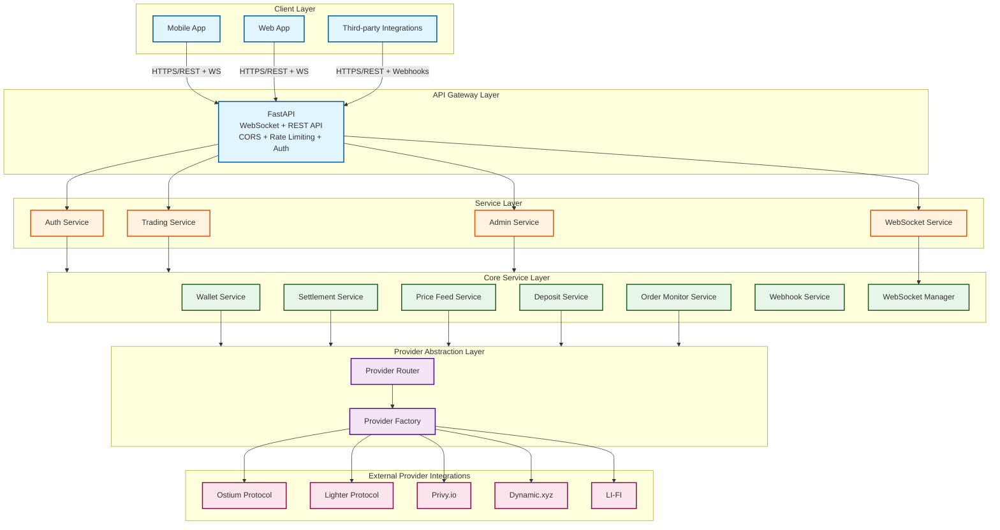

# Technical Design Document (TDD)
## MarqetFi API

**Version:** 1.0.0
**Last Updated:** 2025-12-24
**Status:** Active

---

## 1. Document Overview

### 1.1 Purpose
This document provides a comprehensive technical design for the MarqetFi API, including system architecture, component specifications, data models, API design, security considerations, and deployment strategies.

### 1.2 Scope
- System architecture and component design
- Data models and database schema
- API specifications and endpoints
- Integration patterns and protocols
- Security architecture
- Performance and scalability design
- Deployment and operations

### 1.3 Audience
- Software engineers implementing the system
- System architects reviewing design
- DevOps engineers deploying infrastructure
- QA engineers writing tests
- Product managers understanding technical constraints

---

## 2. System Architecture

### 2.1 High-Level Architecture



### 2.2 Component Architecture

#### 2.2.1 API Layer (`app/api/`)
- **Purpose**: HTTP request handling, validation, response formatting
- **Components**:
  - `v1/`: API version 1 endpoints
    - `auth/`: Authentication endpoints
    - `trading/`: Trading endpoints
    - `prices/`: Price feed endpoints
    - `deposits/`: Deposit endpoints
    - `admin/`: Admin endpoints
    - `webhooks/`: Webhook configuration endpoints
  - `websocket/`: WebSocket endpoints
    - `connection.py`: WebSocket connection handler
    - `subscriptions.py`: Subscription management
    - `messages.py`: Message types and handlers
  - `dependencies.py`: Dependency injection setup

#### 2.2.2 Service Layer (`app/services/`)
- **Purpose**: Business logic, orchestration
- **Components**:
  - `auth_service.py`: Authentication logic
  - `trading_service.py`: Trading operations
  - `wallet_service.py`: Wallet management
  - `settlement_service.py`: Trade settlement
  - `price_feed_service.py`: Price aggregation
  - `deposit_service.py`: Deposit processing
  - `configuration_service.py`: Configuration management
  - `order_monitoring_service.py`: Advanced order monitoring (stop-loss, take-profit)
  - `websocket_service.py`: WebSocket connection and message management
  - `webhook_service.py`: Webhook delivery and retry logic
  - `providers/`: Provider implementations
  - `wallet_providers/`: Wallet provider implementations

#### 2.2.3 Repository Layer (`app/repositories/`)
- **Purpose**: Data access abstraction
- **Pattern**: Repository pattern with base class
- **Components**:
  - `base.py`: Base repository with CRUD operations
  - `user_repository.py`: User data access
  - `trade_repository.py`: Trade data access
  - `wallet_repository.py`: Wallet data access
  - `deposit_repository.py`: Deposit data access
  - `order_repository.py`: Order data access
  - `position_repository.py`: Position data access

#### 2.2.4 Model Layer (`app/models/`)
- **Purpose**: Database models (SQLAlchemy ORM)
- **Components**:
  - `user.py`: User model
  - `auth.py`: Authentication models (OAuth, Wallet, Session)
  - `trading.py`: Trading models (Order, Trade, Position)
  - `wallet.py`: Wallet model
  - `deposit.py`: Deposit and swap models
  - `analytics.py`: Analytics models
  - `provider.py`: Provider-specific models
  - `app_configuration.py`: Configuration models

#### 2.2.5 Schema Layer (`app/schemas/`)
- **Purpose**: Pydantic models for request/response validation
- **Components**:
  - `auth/`: Authentication schemas
  - `trading.py`: Trading schemas
  - `user.py`: User schemas
  - `wallet.py`: Wallet schemas
  - `deposit.py`: Deposit schemas
  - `price.py`: Price schemas
  - `configuration.py`: Configuration schemas

#### 2.2.6 Core Layer (`app/core/`)
- **Purpose**: Core infrastructure components
- **Components**:
  - `database.py`: Database connection and session management
  - `cache.py`: Redis cache manager
  - `security.py`: Security utilities (hashing, JWT)
  - `logging.py`: Logging configuration
  - `wallet_signer.py`: Wallet signing utilities

#### 2.2.7 Configuration Layer (`app/config/`)
- **Purpose**: Configuration management
- **Components**:
  - `settings.py`: Application settings (Pydantic Settings)
  - `providers/`: Provider configuration classes
    - `base.py`: Base provider config
    - `ostium.py`: Ostium configuration
    - `lighter.py`: Lighter configuration
    - `lifi.py`: LI-FI configuration

#### 2.2.8 Background Processing (`app/tasks/`)
- **Purpose**: Asynchronous task processing
- **Components**:
  - `celery_app.py`: Celery application setup
  - `example_tasks.py`: Example background tasks

---

## 3. Data Models

### 3.1 Core Entities

#### 3.1.1 User
```python
User:
  - id: int (PK)
  - email: str (unique, indexed)
  - username: str (unique, indexed)
  - hashed_password: str | None
  - auth0_user_id: str | None (unique, indexed)
  - privy_user_id: str | None (unique, indexed)
  - auth_method: AuthMethod (enum)
  - wallet_type: WalletType | None
  - wallet_address: str | None (indexed)
  - mpc_wallet_id: int | None (FK to Wallet)
  - is_active: bool
  - is_superuser: bool
  - feature_access_level: FeatureAccessLevel
  - email_verified: bool
  - last_login_at: datetime | None
  - created_at: datetime
  - updated_at: datetime
```

#### 3.1.2 Wallet
```python
Wallet:
  - id: int (PK)
  - user_id: int (FK to User)
  - wallet_address: str (indexed)
  - wallet_type: WalletType
  - provider: str (privy, dynamic, external)
  - provider_wallet_id: str | None
  - is_active: bool
  - created_at: datetime
  - updated_at: datetime
```

#### 3.1.3 Trade
```python
Trade:
  - id: int (PK)
  - user_id: int (FK to User)
  - provider: str (ostium, lighter)
  - asset: str
  - asset_type: int
  - direction: bool (true=long, false=short)
  - collateral: Decimal
  - leverage: int
  - entry_price: Decimal
  - current_price: Decimal | None
  - pnl: Decimal | None
  - status: TradeStatus (enum)
  - pair_id: int | None
  - trade_index: int | None
  - transaction_hash: str | None
  - created_at: datetime
  - updated_at: datetime
  - closed_at: datetime | None
```

#### 3.1.4 Order
```python
Order:
  - id: int (PK)
  - user_id: int (FK to User)
  - trade_id: int | None (FK to Trade)
  - provider: str
  - asset: str
  - order_type: OrderType (enum: MARKET, LIMIT, STOP_LOSS, TAKE_PROFIT, TRAILING_STOP, OCO)
  - side: OrderSide (enum)
  - quantity: Decimal
  - price: Decimal | None
  - stop_price: Decimal | None  # For stop-loss orders
  - take_profit_price: Decimal | None  # For take-profit orders
  - trailing_stop_distance: Decimal | None  # For trailing stop orders
  - trailing_stop_percentage: Decimal | None  # Alternative trailing stop
  - oco_stop_price: Decimal | None  # For OCO orders
  - oco_take_profit_price: Decimal | None  # For OCO orders
  - status: OrderStatus (enum)
  - transaction_hash: str | None
  - triggered_at: datetime | None  # When stop/take-profit triggered
  - created_at: datetime
  - updated_at: datetime
```

#### 3.1.5 Position
```python
Position:
  - id: int (PK)
  - user_id: int (FK to User)
  - trade_id: int (FK to Trade)
  - provider: str
  - asset: str
  - side: PositionSide (enum)
  - size: Decimal
  - entry_price: Decimal
  - current_price: Decimal | None
  - unrealized_pnl: Decimal | None
  - margin: Decimal
  - leverage: int
  - is_open: bool
  - created_at: datetime
  - updated_at: datetime
  - closed_at: datetime | None
```

#### 3.1.6 Deposit
```python
Deposit:
  - id: int (PK)
  - user_id: int (FK to User)
  - token_address: str
  - token_symbol: str
  - chain: str
  - amount: Decimal
  - status: str (pending, processing, completed, failed)
  - provider: str (ostium, lighter)
  - transaction_hash: str | None
  - created_at: datetime
  - updated_at: datetime
```

#### 3.1.7 TokenSwap
```python
TokenSwap:
  - id: int (PK)
  - deposit_id: int (FK to Deposit)
  - from_token: str
  - to_token: str  # Always USDC
  - from_chain: str  # Any chain
  - to_chain: str  # Always arbitrum
  - amount: Decimal
  - swap_provider: str (lifi)  # Primary provider, always LI-FI
  - swap_status: str (pending, processing, completed, failed)
  - swap_transaction_hash: str | None
  - estimated_output: Decimal | None
  - actual_output: Decimal | None
  - error_message: str | None
  - created_at: datetime
  - updated_at: datetime
  - completed_at: datetime | None
```

#### 3.1.8 WebhookConfiguration
```python
WebhookConfiguration:
  - id: int (PK)
  - user_id: int (FK to User)
  - url: str  # Webhook endpoint URL
  - secret: str  # HMAC secret for signing
  - event_types: list[str]  # Subscribed event types
  - is_active: bool
  - retry_count: int  # Current retry count for failed deliveries
  - last_delivery_at: datetime | None
  - created_at: datetime
  - updated_at: datetime
```

#### 3.1.9 WebhookDelivery
```python
WebhookDelivery:
  - id: int (PK)
  - webhook_config_id: int (FK to WebhookConfiguration)
  - event_type: str
  - payload: JSON  # Event payload
  - status: str (pending, delivered, failed)
  - response_code: int | None
  - response_body: str | None
  - attempts: int
  - delivered_at: datetime | None
  - created_at: datetime
  - updated_at: datetime
```

### 3.2 Configuration Models

#### 3.2.1 AppConfiguration
```python
AppConfiguration:
  - id: int (PK)
  - config_key: str (unique, indexed)
  - config_value: str
  - config_type: str (string, int, float, bool, json)
  - category: str (security, database, redis, etc.)
  - description: str | None
  - is_encrypted: bool
  - is_active: bool
  - created_at: datetime
  - updated_at: datetime
```

#### 3.2.2 ProviderConfiguration
```python
ProviderConfiguration:
  - id: int (PK)
  - provider_name: str (indexed)
  - provider_type: str (trading, price, settlement, swap, wallet)
  - config_data: JSON
  - is_active: bool
  - version: int
  - created_at: datetime
  - updated_at: datetime
```

### 3.3 Authentication Models

#### 3.3.1 OAuthConnection
```python
OAuthConnection:
  - id: int (PK)
  - user_id: int (FK to User)
  - provider: str (google, apple)
  - provider_user_id: str
  - access_token: str (encrypted)
  - refresh_token: str | None (encrypted)
  - expires_at: datetime | None
  - created_at: datetime
  - updated_at: datetime
```

#### 3.3.2 WalletConnection
```python
WalletConnection:
  - id: int (PK)
  - user_id: int (FK to User)
  - wallet_address: str (indexed)
  - wallet_type: WalletType
  - signature: str
  - verified: bool
  - created_at: datetime
  - updated_at: datetime
```

#### 3.3.3 Session
```python
Session:
  - id: int (PK)
  - user_id: int (FK to User)
  - token: str (unique, indexed)
  - refresh_token: str | None (unique, indexed)
  - expires_at: datetime
  - created_at: datetime
  - updated_at: datetime
```

---

## 4. API Specifications

### 4.1 Authentication Endpoints

#### 4.1.1 Register
```
POST /api/v1/auth/register
Request:
  {
    "email": "user@example.com",
    "username": "user123",
    "password": "securepassword"
  }
Response: 201
  {
    "access_token": "jwt_token",
    "refresh_token": "refresh_token",
    "token_type": "bearer",
    "expires_in": 1800
  }
```

#### 4.1.2 Login
```
POST /api/v1/auth/login
Request:
  {
    "email": "user@example.com",
    "password": "securepassword"
  }
Response: 200
  {
    "access_token": "jwt_token",
    "refresh_token": "refresh_token",
    "token_type": "bearer",
    "expires_in": 1800
  }
```

#### 4.1.3 Wallet Connect
```
POST /api/v1/auth/wallet/connect
Request:
  {
    "wallet_address": "0x...",
    "signature": "0x...",
    "message": "verification_message"
  }
Response: 200
  {
    "access_token": "jwt_token",
    "refresh_token": "refresh_token",
    "token_type": "bearer",
    "expires_in": 1800
  }
```

### 4.2 Trading Endpoints

#### 4.2.1 Open Trade
```
POST /api/v1/trading/trades
Authorization: Bearer <token>
Request:
  {
    "collateral": 1000.0,
    "leverage": 10,
    "asset_type": 0,
    "asset": "BTC",
    "direction": true,
    "order_type": "MARKET",  # MARKET, LIMIT, STOP_LOSS, TAKE_PROFIT, TRAILING_STOP, OCO
    "price": 45000.0,  # Required for LIMIT orders
    "stop_price": 40000.0,  # Required for STOP_LOSS orders
    "take_profit_price": 50000.0,  # Required for TAKE_PROFIT orders
    "trailing_stop_distance": 500.0,  # For TRAILING_STOP orders
    "trailing_stop_percentage": 2.0,  # Alternative: percentage-based trailing stop
    "oco_stop_price": 40000.0,  # For OCO orders
    "oco_take_profit_price": 50000.0  # For OCO orders
  }
Response: 201
  {
    "transaction_hash": "0x...",
    "pair_id": 1,
    "trade_index": 0,
    "status": "success",
    "order_id": 123
  }
```

#### 4.2.2 Close Trade
```
DELETE /api/v1/trading/trades/{pair_id}/{index}
Authorization: Bearer <token>
Response: 200
  {
    "transaction_hash": "0x...",
    "status": "closed"
  }
```

#### 4.2.3 Get Positions
```
GET /api/v1/trading/positions
Authorization: Bearer <token>
Response: 200
  {
    "positions": [
      {
        "id": 1,
        "asset": "BTC",
        "side": "long",
        "size": 0.1,
        "entry_price": 45000.0,
        "current_price": 46000.0,
        "unrealized_pnl": 100.0,
        "leverage": 10
      }
    ]
  }
```

### 4.3 Price Endpoints

#### 4.3.1 Get Price
```
GET /api/v1/prices/{pair}?use_cache=true
Response: 200
  {
    "price": 45000.0,
    "timestamp": "2025-01-21T12:00:00Z",
    "source": "lighter",
    "asset": "BTC",
    "quote": "USD"
  }
```

#### 4.3.2 Get Prices (Bulk)
```
GET /api/v1/prices?pairs=BTCUSDT,EURUSD,ETHUSDT&use_cache=true
Response: 200
  {
    "prices": [
      {
        "pair": "BTCUSDT",
        "price": 45000.0,
        "timestamp": "2025-01-21T12:00:00Z",
        "source": "lighter"
      },
      {
        "pair": "EURUSD",
        "price": 1.0850,
        "timestamp": "2025-01-21T12:00:00Z",
        "source": "ostium"
      }
    ]
  }
```

### 4.4 Deposit Endpoints

#### 4.4.1 Create Deposit
```
POST /api/v1/deposits
Authorization: Bearer <token>
Request:
  {
    "token_address": "0x...",  # Any token address on any chain
    "token_symbol": "ETH",  # Any token symbol (ETH, USDT, DAI, etc.)
    "chain": "ethereum",  # Any supported chain
    "amount": "1.0",
    "transaction_hash": "0x..."  # Optional: deposit transaction hash
  }
Response: 201
  {
    "id": 1,
    "status": "processing",
    "token_symbol": "ETH",
    "chain": "ethereum",
    "amount": "1.0",
    "target_token": "USDC",
    "target_chain": "arbitrum",
    "swap_provider": "lifi",
    "swap_status": "pending",
    "created_at": "2025-01-21T12:00:00Z"
  }
Note: System automatically initiates swap to USDC on Arbitrum via LI-FI
```

#### 4.4.2 Get Deposit Status
```
GET /api/v1/deposits/{deposit_id}/swap-status
Authorization: Bearer <token>
Response: 200
  {
    "deposit_id": 1,
    "swap_needed": true,
    "swaps": [
      {
        "id": 1,
        "status": "processing",
        "from_token": "USDT",
        "to_token": "USDC",
        "from_chain": "ethereum",
        "to_chain": "arbitrum",
        "amount": "1000.0",
        "estimated_output": "998.5"
      }
    ]
  }
```

### 4.5 Admin Endpoints

#### 4.5.1 List App Configurations
```
GET /api/v1/admin/config/app-configs?category=security&skip=0&limit=100
Authorization: Bearer <admin-token>
Response: 200
  {
    "items": [
      {
        "id": 1,
        "config_key": "SECRET_KEY",
        "config_type": "string",
        "category": "security",
        "is_encrypted": true,
        "is_active": true
      }
    ],
    "total": 1,
    "skip": 0,
    "limit": 100
  }
```

#### 4.5.2 Update Provider Configuration
```
PUT /api/v1/admin/config/provider-configs/{config_id}
Authorization: Bearer <admin-token>
Request:
  {
    "config_data": {
      "enabled": true,
      "api_url": "https://api.example.com",
      "timeout": 30
    },
    "activate": true
  }
Response: 200
  {
    "id": 1,
    "provider_name": "lifi",
    "provider_type": "swap",
    "is_active": true,
    "version": 2
  }
```

### 4.6 WebSocket Endpoints

#### 4.6.1 WebSocket Connection
```
WS /ws
Connection: Upgrade
Upgrade: websocket
Authorization: Bearer <token>

Message Format (JSON):
{
  "type": "subscribe|unsubscribe|ping",
  "channel": "prices|trades|positions|deposits",
  "data": {
    "pairs": ["BTCUSDT", "ETHUSDT"],  # For prices channel
    "trade_ids": [1, 2, 3]  # For trades channel
  }
}

Response Format:
{
  "type": "price_update|trade_update|position_update|deposit_update|pong|error",
  "channel": "prices|trades|positions|deposits",
  "data": {
    "pair": "BTCUSDT",
    "price": 45000.0,
    "timestamp": "2025-01-21T12:00:00Z"
  },
  "timestamp": "2025-01-21T12:00:00Z"
}
```

#### 4.6.2 WebSocket Channels

**Prices Channel:**
```json
// Subscribe
{
  "type": "subscribe",
  "channel": "prices",
  "data": {
    "pairs": ["BTCUSDT", "ETHUSDT", "EURUSD"]
  }
}

// Price Update
{
  "type": "price_update",
  "channel": "prices",
  "data": {
    "pair": "BTCUSDT",
    "price": 45000.0,
    "timestamp": "2025-01-21T12:00:00Z",
    "source": "lighter"
  }
}
```

**Trades Channel:**
```json
// Subscribe (automatically subscribes to user's trades)
{
  "type": "subscribe",
  "channel": "trades"
}

// Trade Update
{
  "type": "trade_update",
  "channel": "trades",
  "data": {
    "trade_id": 123,
    "status": "executed",
    "transaction_hash": "0x...",
    "entry_price": 45000.0
  }
}
```

**Positions Channel:**
```json
// Subscribe (automatically subscribes to user's positions)
{
  "type": "subscribe",
  "channel": "positions"
}

// Position Update
{
  "type": "position_update",
  "channel": "positions",
  "data": {
    "position_id": 456,
    "current_price": 46000.0,
    "unrealized_pnl": 100.0,
    "updated_at": "2025-01-21T12:00:00Z"
  }
}
```

**Deposits Channel:**
```json
// Subscribe (automatically subscribes to user's deposits)
{
  "type": "subscribe",
  "channel": "deposits"
}

// Deposit Update
{
  "type": "deposit_update",
  "channel": "deposits",
  "data": {
    "deposit_id": 789,
    "status": "processing",
    "swap_status": "in_progress",
    "swap_progress": 75.5
  }
}
```

### 4.7 Webhook Endpoints

#### 4.7.1 Create Webhook Configuration
```
POST /api/v1/webhooks
Authorization: Bearer <token>
Request:
  {
    "url": "https://example.com/webhook",
    "secret": "webhook_secret_key",
    "event_types": [
      "trade.executed",
      "trade.closed",
      "position.updated",
      "deposit.completed",
      "swap.completed"
    ]
  }
Response: 201
  {
    "id": 1,
    "url": "https://example.com/webhook",
    "event_types": ["trade.executed", "trade.closed"],
    "is_active": true,
    "created_at": "2025-01-21T12:00:00Z"
  }
```

#### 4.7.2 List Webhook Configurations
```
GET /api/v1/webhooks
Authorization: Bearer <token>
Response: 200
  {
    "webhooks": [
      {
        "id": 1,
        "url": "https://example.com/webhook",
        "event_types": ["trade.executed"],
        "is_active": true,
        "last_delivery_at": "2025-01-21T11:00:00Z"
      }
    ]
  }
```

#### 4.7.3 Update Webhook Configuration
```
PUT /api/v1/webhooks/{webhook_id}
Authorization: Bearer <token>
Request:
  {
    "url": "https://new-url.com/webhook",
    "event_types": ["trade.executed", "position.updated"],
    "is_active": true
  }
Response: 200
  {
    "id": 1,
    "url": "https://new-url.com/webhook",
    "event_types": ["trade.executed", "position.updated"],
    "is_active": true
  }
```

#### 4.7.4 Webhook Event Payload Format
```
POST {webhook_url}
Headers:
  X-Webhook-Signature: sha256=...
  X-Webhook-Event-Type: trade.executed
  X-Webhook-Delivery-ID: delivery_123
  X-Webhook-Timestamp: 1234567890

Body:
{
  "event_type": "trade.executed",
  "timestamp": "2025-01-21T12:00:00Z",
  "data": {
    "trade_id": 123,
    "user_id": 456,
    "asset": "BTC",
    "direction": "long",
    "entry_price": 45000.0,
    "collateral": 1000.0,
    "leverage": 10,
    "transaction_hash": "0x..."
  }
}
```

---

## 5. Integration Patterns

### 5.1 Provider Pattern

#### 5.1.1 Base Provider Interface
```python
class BaseTradingProvider(ABC):
    @abstractmethod
    async def get_pairs(self) -> list[Pair]:
        """Get available trading pairs."""

    @abstractmethod
    async def get_price(self, asset: str, quote: str) -> Price:
        """Get current price."""

    @abstractmethod
    async def open_trade(self, trade_params: TradeParams) -> TradeResult:
        """Execute trade."""

    @abstractmethod
    async def close_trade(self, pair_id: int, index: int) -> TradeResult:
        """Close trade."""
```

#### 5.1.2 Provider Factory
```python
class ProviderFactory:
    def __init__(self, config_service: ConfigurationService):
        self.config_service = config_service
        self._providers: dict[str, BaseTradingProvider] = {}

    async def get_provider(self, provider_name: str) -> BaseTradingProvider:
        """Get or create provider instance."""
        if provider_name not in self._providers:
            config = await self.config_service.get_provider_config(
                provider_name, "trading"
            )
            self._providers[provider_name] = self._create_provider(
                provider_name, config
            )
        return self._providers[provider_name]
```

### 5.2 Provider Router

```python
class ProviderRouter:
    def __init__(self, factory: ProviderFactory):
        self.factory = factory
        self.asset_routing: dict[str, str] = {}
        self.category_routing: dict[str, str] = {}

    async def route_for_asset(self, asset: str) -> str:
        """Route asset to appropriate provider."""
        # 1. Check direct asset mapping
        if asset in self.asset_routing:
            return self.asset_routing[asset]

        # 2. Check category mapping
        category = self._get_category(asset)
        if category in self.category_routing:
            return self.category_routing[category]

        # 3. Default provider
        return "ostium"
```

### 5.3 Configuration Loading

```python
class ConfigurationService:
    async def get_config_with_fallback(
        self, key: str, default: Any
    ) -> Any:
        """Get config with fallback chain: DB -> Env -> Default."""
        # 1. Try database
        db_config = await self.get_app_config(key)
        if db_config:
            return self._parse_value(db_config)

        # 2. Try environment
        env_value = os.getenv(key)
        if env_value:
            return self._parse_value(env_value)

        # 3. Return default
        return default
```

### 5.4 WebSocket Architecture

#### 5.4.1 Connection Management
```python
class WebSocketManager:
    def __init__(self):
        self.connections: dict[str, WebSocket] = {}  # user_id -> WebSocket
        self.subscriptions: dict[str, set[str]] = {}  # user_id -> set of channels

    async def connect(self, websocket: WebSocket, user_id: int):
        """Handle new WebSocket connection."""
        await websocket.accept()
        self.connections[user_id] = websocket
        self.subscriptions[user_id] = set()

    async def subscribe(self, user_id: int, channel: str, data: dict):
        """Subscribe user to channel."""
        if user_id in self.subscriptions:
            self.subscriptions[user_id].add(channel)
            # Start sending updates for this channel

    async def send_update(self, user_id: int, channel: str, data: dict):
        """Send update to subscribed user."""
        if user_id in self.connections and channel in self.subscriptions.get(user_id, set()):
            await self.connections[user_id].send_json({
                "type": f"{channel}_update",
                "channel": channel,
                "data": data,
                "timestamp": datetime.utcnow().isoformat()
            })
```

#### 5.4.2 Price Streaming
```python
class PriceStreamingService:
    def __init__(self, websocket_manager: WebSocketManager):
        self.ws_manager = websocket_manager
        self.price_cache: dict[str, Price] = {}

    async def broadcast_price_update(self, pair: str, price: Price):
        """Broadcast price update to all subscribers."""
        self.price_cache[pair] = price
        # Get all users subscribed to prices channel
        for user_id, channels in self.ws_manager.subscriptions.items():
            if "prices" in channels:
                # Check if user subscribed to this specific pair
                await self.ws_manager.send_update(
                    user_id,
                    "prices",
                    {"pair": pair, "price": price.value, "timestamp": price.timestamp}
                )
```

#### 5.4.3 Order Monitoring Service
```python
class OrderMonitoringService:
    """Monitor advanced orders (stop-loss, take-profit, trailing stops)."""

    async def monitor_order(self, order: Order, position: Position):
        """Monitor order and trigger when conditions met."""
        while order.status == OrderStatus.PENDING:
            current_price = await self.get_current_price(order.asset)

            if order.order_type == OrderType.STOP_LOSS:
                if self._check_stop_loss(order, current_price, position):
                    await self._trigger_order(order)

            elif order.order_type == OrderType.TAKE_PROFIT:
                if self._check_take_profit(order, current_price, position):
                    await self._trigger_order(order)

            elif order.order_type == OrderType.TRAILING_STOP:
                await self._update_trailing_stop(order, current_price, position)

            await asyncio.sleep(1)  # Check every second

    def _check_stop_loss(self, order: Order, price: Decimal, position: Position) -> bool:
        """Check if stop-loss should trigger."""
        if position.side == PositionSide.LONG:
            return price <= order.stop_price
        else:
            return price >= order.stop_price

    def _update_trailing_stop(self, order: Order, price: Decimal, position: Position):
        """Update trailing stop price."""
        if position.side == PositionSide.LONG:
            # For long positions, trailing stop moves up
            new_stop = price - order.trailing_stop_distance
            if new_stop > order.stop_price:
                order.stop_price = new_stop
        else:
            # For short positions, trailing stop moves down
            new_stop = price + order.trailing_stop_distance
            if new_stop < order.stop_price:
                order.stop_price = new_stop
```

### 5.5 Webhook Delivery System

#### 5.5.1 Webhook Service
```python
class WebhookService:
    def __init__(self, db: AsyncSession):
        self.db = db
        self.http_client = httpx.AsyncClient()

    async def send_webhook(self, user_id: int, event_type: str, event_data: dict):
        """Send webhook event to user's configured endpoints."""
        webhooks = await self.get_active_webhooks(user_id, event_type)

        for webhook in webhooks:
            payload = {
                "event_type": event_type,
                "timestamp": datetime.utcnow().isoformat(),
                "data": event_data
            }

            signature = self._generate_signature(webhook.secret, payload)

            try:
                response = await self.http_client.post(
                    webhook.url,
                    json=payload,
                    headers={
                        "X-Webhook-Signature": f"sha256={signature}",
                        "X-Webhook-Event-Type": event_type,
                        "X-Webhook-Delivery-ID": str(uuid.uuid4()),
                        "X-Webhook-Timestamp": str(int(time.time()))
                    },
                    timeout=10.0
                )

                await self._record_delivery(webhook.id, event_type, response.status_code, True)

            except Exception as e:
                await self._record_delivery(webhook.id, event_type, None, False)
                await self._schedule_retry(webhook.id, event_type, payload)

    def _generate_signature(self, secret: str, payload: dict) -> str:
        """Generate HMAC signature for webhook payload."""
        message = json.dumps(payload, sort_keys=True)
        signature = hmac.new(
            secret.encode(),
            message.encode(),
            hashlib.sha256
        ).hexdigest()
        return signature

    async def _schedule_retry(self, webhook_id: int, event_type: str, payload: dict):
        """Schedule webhook retry with exponential backoff."""
        # Use Celery task for retry
        retry_webhook.delay(webhook_id, event_type, payload)
```

#### 5.5.2 Deposit Auto-Conversion Flow
```python
class DepositService:
    async def process_deposit(self, deposit: Deposit):
        """Process deposit and auto-convert to USDC on Arbitrum."""
        # All deposits are converted to USDC on Arbitrum via LI-FI
        target_token = "USDC"
        target_chain = "arbitrum"

        # Check if conversion needed
        if deposit.token_symbol == target_token and deposit.chain == target_chain:
            # Already correct, mark as completed
            deposit.status = DepositStatus.COMPLETED
        else:
            # Initiate swap via LI-FI
            swap = await self._create_swap(
                deposit_id=deposit.id,
                from_token=deposit.token_symbol,
                from_chain=deposit.chain,
                to_token=target_token,
                to_chain=target_chain,
                amount=deposit.amount,
                provider="lifi"  # Always use LI-FI
            )

            # Execute swap
            await self._execute_swap(swap)

        # Send WebSocket update
        await websocket_service.send_deposit_update(deposit.user_id, deposit)

        # Send webhook
        await webhook_service.send_webhook(
            deposit.user_id,
            "deposit.completed",
            {"deposit_id": deposit.id, "status": deposit.status}
        )
```

---

## 6. Security Architecture

### 6.1 Authentication & Authorization

#### 6.1.1 JWT Token Structure
```json
{
  "sub": "user_id",
  "email": "user@example.com",
  "exp": 1234567890,
  "iat": 1234567890,
  "auth_method": "email",
  "permissions": ["trade", "deposit"]
}
```

#### 6.1.2 Token Validation Flow
```
1. Extract token from Authorization header
2. Verify signature using SECRET_KEY
3. Check expiration
4. Load user from database
5. Verify user is active
6. Attach user to request context
```

### 6.2 Data Encryption

#### 6.2.1 Encryption at Rest
- **Algorithm**: Fernet (symmetric encryption)
- **Key Derivation**: PBKDF2 from SECRET_KEY
- **Scope**: Sensitive configuration values, API keys, private keys

#### 6.2.2 Encryption in Transit
- **Protocol**: HTTPS/TLS 1.3
- **Certificate**: Valid SSL certificate
- **Cipher Suites**: Strong, modern cipher suites

### 6.3 Private Key Management

#### 6.3.1 Key Storage
- **Never stored in database**: Private keys never persisted
- **Environment variables**: Only for service account keys
- **MPC Wallets**: Keys managed by provider (Privy, Dynamic)
- **Wallet Signer**: In-memory only, never logged

#### 6.3.2 Key Usage
```python
# NEVER log private keys
# NEVER return in API responses
# NEVER store in database
# Use only for signing transactions
```

### 6.4 Input Validation

#### 6.4.1 Pydantic Schemas
- All API inputs validated via Pydantic models
- Type checking, range validation, format validation
- Automatic error messages

#### 6.4.2 SQL Injection Prevention
- SQLAlchemy ORM (parameterized queries)
- No raw SQL with user input
- Input sanitization

### 6.5 Rate Limiting

#### 6.5.1 Implementation
- **Strategy**: Token bucket algorithm
- **Storage**: Redis
- **Limits**: Configurable per endpoint/user

#### 6.5.2 Default Limits
- **Price queries**: 100 requests/minute
- **Trade execution**: 10 requests/minute
- **Deposit creation**: 5 requests/minute
- **Admin operations**: 50 requests/minute

---

## 7. Performance Design

### 7.1 Caching Strategy

#### 7.1.1 Redis Cache
- **Price Data**: 30-second TTL
- **Trading Pairs**: 5-minute TTL
- **User Sessions**: 30-minute TTL
- **Configuration**: 1-minute TTL (invalidate on update)
- **WebSocket Connections**: Connection metadata and subscriptions
- **Webhook Configurations**: Active webhook configs (5-minute TTL)

#### 7.1.2 Cache Keys
```
price:{asset}:{quote} -> Price data
pairs:{provider} -> Trading pairs
session:{token} -> Session data
config:{key} -> Configuration value
```

### 7.2 Database Optimization

#### 7.2.1 Indexing Strategy
- **Primary Keys**: All tables
- **Foreign Keys**: All FK columns
- **Query Patterns**: Index frequently queried columns
- **Composite Indexes**: For multi-column queries

#### 7.2.2 Connection Pooling
- **Pool Size**: 20 connections
- **Max Overflow**: 10 connections
- **Pool Timeout**: 30 seconds
- **Connection Reuse**: Enabled

### 7.3 Async Architecture

#### 7.3.1 Async I/O
- **Database**: asyncpg (async PostgreSQL driver)
- **HTTP Client**: httpx (async HTTP client)
- **Redis**: aioredis (async Redis client)
- **All I/O**: Non-blocking async/await

#### 7.3.2 Background Tasks
- **Celery**: Async task processing
- **RabbitMQ**: Message broker
- **Task Types**:
  - Trade settlement
  - Swap execution (LI-FI auto-conversion)
  - Price updates
  - Analytics calculations
  - Advanced order monitoring (stop-loss, take-profit, trailing stops)
  - Webhook delivery and retries
  - WebSocket message broadcasting

### 7.4 Scalability

#### 7.4.1 Horizontal Scaling
- **Stateless API**: All instances identical
- **Shared State**: Redis for sessions/cache
- **Database**: Read replicas for read-heavy operations
- **Load Balancer**: Distribute requests across instances

#### 7.4.2 Vertical Scaling
- **Resource Limits**: Configurable per service
- **Memory**: Optimize for connection pooling
- **CPU**: Async operations minimize CPU usage

---

## 8. Deployment Architecture

### 8.1 Infrastructure Components

#### 8.1.1 Application Servers
- **Runtime**: Python 3.12
- **Framework**: FastAPI + Uvicorn
- **Instances**: Multiple (load balanced)
- **Health Checks**: `/health` endpoint

#### 8.1.2 Database
- **Type**: PostgreSQL 14+
- **Primary**: Write operations
- **Replicas**: Read operations (optional)
- **Backup**: Daily automated backups
- **Migrations**: Alembic

#### 8.1.3 Cache
- **Type**: Redis 6+
- **Mode**: Standalone or cluster
- **Persistence**: RDB snapshots
- **Memory**: Configurable max memory

#### 8.1.4 Message Queue
- **Type**: RabbitMQ 3.9+
- **Durability**: Persistent queues
- **Clustering**: Optional for HA
- **Monitoring**: Management UI

### 8.2 Containerization

#### 8.2.1 Docker
```dockerfile
FROM python:3.12-slim
WORKDIR /app
COPY requirements.txt .
RUN pip install --no-cache-dir -r requirements.txt
COPY . .
CMD ["uvicorn", "app.main:app", "--host", "0.0.0.0", "--port", "8000"]
```

#### 8.2.2 Docker Compose
```yaml
services:
  api:
    build: .
    ports:
      - "8000:8000"
    environment:
      - DATABASE_URL=postgresql+asyncpg://...
    depends_on:
      - postgres
      - redis
      - rabbitmq

  postgres:
    image: postgres:14
    volumes:
      - postgres_data:/var/lib/postgresql/data

  redis:
    image: redis:6-alpine

  rabbitmq:
    image: rabbitmq:3.9-management
```

### 8.3 Environment Configuration

#### 8.3.1 Environment Variables
- **Required**: Database URL, Redis URL, Secret Key
- **Optional**: Provider API keys, feature flags
- **Sensitive**: Encrypted in database when possible

#### 8.3.2 Configuration Priority
1. Database configuration (highest)
2. Environment variables
3. Default values (lowest)

### 8.4 Monitoring & Logging

#### 8.4.1 Logging
- **Framework**: Loguru
- **Format**: JSON (production), Pretty (development)
- **Levels**: DEBUG, INFO, WARNING, ERROR, CRITICAL
- **Destinations**: stdout, files, external services

#### 8.4.2 Metrics
- **API Metrics**: Request count, latency, error rate
- **Business Metrics**: Trade volume, user count, deposits
- **System Metrics**: CPU, memory, database connections
- **Provider Metrics**: Provider response times, error rates

#### 8.4.3 Alerting
- **Uptime**: API availability < 99%
- **Errors**: Error rate > 1%
- **Latency**: P95 latency > 1s
- **Database**: Connection pool exhaustion
- **Providers**: Provider API failures

---

## 9. Error Handling

### 9.1 Error Response Format

```json
{
  "error": {
    "code": "TRADE_EXECUTION_FAILED",
    "message": "Failed to execute trade",
    "details": {
      "provider": "ostium",
      "reason": "Insufficient liquidity"
    },
    "timestamp": "2025-01-21T12:00:00Z",
    "request_id": "req_123456"
  }
}
```

### 9.2 Error Categories

#### 9.2.1 Client Errors (4xx)
- **400 Bad Request**: Invalid input, validation errors
- **401 Unauthorized**: Authentication required
- **403 Forbidden**: Insufficient permissions
- **404 Not Found**: Resource not found
- **429 Too Many Requests**: Rate limit exceeded

#### 9.2.2 Server Errors (5xx)
- **500 Internal Server Error**: Unexpected errors
- **502 Bad Gateway**: Provider API errors
- **503 Service Unavailable**: Service temporarily unavailable
- **504 Gateway Timeout**: Provider timeout

### 9.3 Retry Logic

#### 9.3.1 External API Calls
- **Strategy**: Exponential backoff
- **Max Attempts**: 3 (configurable)
- **Initial Delay**: 1 second
- **Max Delay**: 10 seconds
- **Retryable Errors**: Timeout, 5xx errors, network errors

---

## 10. Testing Strategy

### 10.1 Test Types

#### 10.1.1 Unit Tests
- **Scope**: Individual functions, classes
- **Framework**: pytest
- **Coverage Target**: >80%
- **Location**: `tests/unit/`

#### 10.1.2 Integration Tests
- **Scope**: API endpoints, service interactions
- **Framework**: pytest + httpx
- **Database**: Test database with fixtures
- **Location**: `tests/integration/`

#### 10.1.3 Provider Tests
- **Scope**: Provider integrations (mocked)
- **Framework**: pytest + responses
- **Mocking**: Mock provider API responses
- **Location**: `tests/unit/test_providers/`

### 10.2 Test Data

#### 10.2.1 Fixtures
- **Users**: Test user accounts
- **Wallets**: Test wallet addresses
- **Trades**: Sample trade data
- **Providers**: Mock provider responses

#### 10.2.2 Test Database
- **Isolation**: Separate test database
- **Setup**: Migrations run before tests
- **Teardown**: Cleanup after tests
- **Transactions**: Rollback after each test

---

## 11. Migration Strategy

### 11.1 Database Migrations

#### 11.1.1 Alembic
- **Tool**: Alembic for schema migrations
- **Versioning**: Sequential version numbers
- **Rollback**: Support for downgrade migrations

#### 11.1.2 Migration Process
```
1. Create migration: alembic revision --autogenerate
2. Review migration script
3. Test migration on staging
4. Apply to production: alembic upgrade head
5. Verify migration success
```

### 11.2 Configuration Migration

#### 11.2.1 Environment to Database
- **Process**: Migrate .env values to database
- **Tool**: Admin API or migration script
- **Encryption**: Encrypt sensitive values
- **Validation**: Verify configuration after migration

---

## 12. Appendix

### 12.1 Technology Stack Summary

| Component | Technology | Version |
|-----------|-----------|---------|
| Language | Python | 3.12 |
| Framework | FastAPI | Latest |
| WebSocket | FastAPI WebSocket | Latest |
| Database | PostgreSQL | 14+ |
| Cache | Redis | 6+ |
| Message Queue | RabbitMQ | 3.9+ |
| Task Queue | Celery | Latest |
| ORM | SQLAlchemy | Latest (async) |
| Validation | Pydantic | Latest |
| HTTP Client | httpx | Latest |
| Logging | Loguru | Latest |

### 12.2 External Dependencies

| Service | Purpose | API Docs |
|---------|---------|----------|
| Ostium Protocol | Trading provider | Provider SDK |
| Lighter Protocol | Trading provider | Provider SDK |
| Privy.io | MPC wallet provider | https://docs.privy.io |
| Dynamic.xyz | MPC wallet provider | https://docs.dynamic.xyz |
| LI-FI | Swap provider | https://docs.li.fi |
| Auth0 | OAuth provider | https://auth0.com/docs |
| Arbitrum | Blockchain network | https://docs.arbitrum.io |

### 12.3 References
- [Architecture Diagram](./assets/hld.svg)
- [Multi-Provider Routing](./multi-provider-routing.md)
- [Deposit & Swap Integration](./deposit-swap-integration.md)
- [Configuration Management](./configuration-management.md)
- [Project Context](../openspec/project.md)
